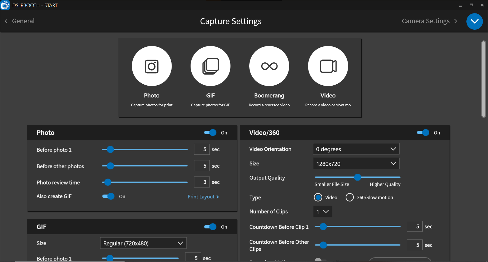

# Photobooth Pro - Development Roadmap

## Project Overview
Commercial photobooth system competing with DSLRBooth
- Backend: C++ with Canon EDSDK
- Frontend: React + TypeScript
- Platform: Windows
- Camera: Canon R100 + Webcam fallback
- UI: Dark theme, professional, inspired by DSLRBooth

## Phase 1: Project Setup & Architecture ✓ IN PROGRESS

### 1.1 Project Structure
- [x] Create project folders
- [ ] Setup CMake for C++ backend
- [ ] Setup Vite + React + TypeScript
- [ ] Configure build scripts

### 1.2 Backend Core (C++)
- [ ] Camera Manager (Canon EDSDK integration)
- [ ] Webcam Manager (fallback)
- [ ] HTTP Server (cpp-httplib)
- [ ] WebSocket Server (live view streaming)
- [ ] Image Processor (OpenCV)
- [ ] Database Manager (SQLite)
- [ ] Logger (spdlog)

### 1.3 Frontend Core (React)
- [ ] Project setup with Vite
- [ ] Tailwind CSS configuration
- [ ] State management (Zustand)
- [ ] WebSocket client
- [ ] API client
- [ ] Routing setup

## Phase 2: Core Features (MVP)

### 2.1 Event Management Screen
- [ ] Event list with thumbnails
- [ ] Create/Edit/Delete events
- [ ] Event settings
- [ ] Launch event button

### 2.2 Live Capture Screen
- [ ] Live view display (full screen)
- [ ] Camera source selector (Canon/Webcam)
- [ ] Capture modes (Photo/GIF/Boomerang/Video)
- [ ] Countdown timer with effects
- [ ] Preview captured images
- [ ] Gallery sidebar

### 2.3 Camera Control
- [ ] Connect/Disconnect camera
- [ ] Live view streaming (30fps)
- [ ] Capture photo (single/burst)
- [ ] Camera settings (ISO, Av, Tv, WB)
- [ ] Auto download after capture

### 2.4 Communication Layer
- [ ] WebSocket for live view
- [ ] REST API for commands
- [ ] Event system for notifications

## Phase 3: Image Processing

### 3.1 Filters & Effects
- [ ] Real-time filters (B&W, Sepia, Vintage, etc.)
- [ ] Brightness/Contrast/Saturation
- [ ] Digital Props overlay
- [ ] Beauty Filter
- [ ] Watermark/Logo overlay

### 3.2 Photo Layouts
- [ ] Single photo
- [ ] Photo strips (2x6, 4x6)
- [ ] Collage templates
- [ ] Custom layouts

## Phase 4: Advanced Features

### 4.1 Capture Modes
- [ ] Photo (single shot)
- [ ] GIF creation
- [ ] Boomerang effect
- [ ] Video recording (3-10s)

### 4.2 Printing
- [ ] Printer integration
- [ ] Print queue
- [ ] Print preview
- [ ] Multiple copies

### 4.3 Sharing
- [ ] Email integration
- [ ] QR code generation
- [ ] Social media sharing
- [ ] Cloud storage

### 4.4 Customization
- [ ] Template editor
- [ ] Branding options
- [ ] Custom overlays
- [ ] Event themes

## Phase 5: Production Ready

### 5.1 Quality & Performance
- [ ] Error handling
- [ ] Logging system
- [ ] Performance optimization
- [ ] Memory management
- [ ] Unit tests

### 5.2 Deployment
- [ ] Electron wrapper
- [ ] Windows installer
- [ ] Auto-update
- [ ] License management

## UI Specifications

### Screen Resolutions
- Landscape: 1920x1080
- Portrait: 1080x1920
- Responsive design for both

### Design System
- Theme: Dark (DSLRBooth-inspired)
- Primary Color: Blue (#0EA5E9)
- Background: Dark gray (#1F2937, #111827)
- Cards: #374151
- Text: White/Gray
- Font: Inter, system-ui

### Key Screens
1. Event Management (Dashboard)
2. Live Capture (Full screen)
3. Gallery View
4. Settings Panel
5. Admin Dashboard

## Technology Stack

### Backend
- C++17/20
- Canon EDSDK 13.19.10
- cpp-httplib (HTTP server)
- websocketpp (WebSocket)
- OpenCV 4.x (Image processing)
- SQLite3 (Database)
- spdlog (Logging)
- nlohmann/json (JSON)

### Frontend
- React 18 + TypeScript
- Vite (Build tool)
- Zustand (State management)
- Socket.io-client (WebSocket)
- Tailwind CSS (Styling)
- Framer Motion (Animations)
- React Router (Navigation)
- Axios (HTTP client)

### Build & Deploy
- CMake (C++ build)
- Electron (Desktop wrapper)
- NSIS (Windows installer)

## Timeline (Estimated)

- Week 1-2: Setup + Camera integration + Basic UI
- Week 3-4: Live view + Capture + WebSocket
- Week 5-6: Image processing + Filters
- Week 7-8: Advanced capture modes + Printing
- Week 9-10: Sharing + Customization
- Week 11-12: Testing + Deployment

## Notes

- Canon R100 supported by EDSDK 13.17.0+
- Webcam fallback using DirectShow (Windows)
- Dark theme consistent across all screens
- Touch-friendly UI (large buttons, gestures)
- Keyboard shortcuts for power users
